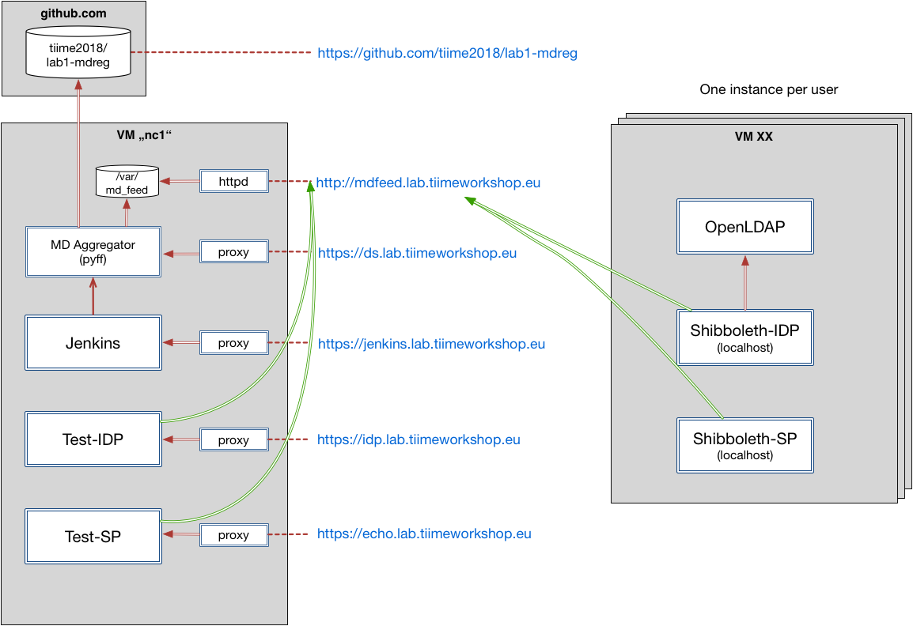

# Lab Exercises: Metadata

## Overview

Goals of this hands-on session:
- Get to know Shibboleth SP (and to some degree IdP) with regard to metadata and attribute management
- Understand metadata aggregation with practical examples
- Identify common errors and learn how to fix them

A VM with a pre-installed and pre-configured Shibboleth SP and IdP will be provided.
In addition there will be one metadata aggregation service that will collect, verify and aggregate the metadata from all participants.

## Lab components

## Steps

### Step 1

* Introduction to the infrastructure: https://github.com/tiime2018/lab1-mdreg/blob/master/docs/MD_Registry.md
* Install and start test VM.
* Install Shibboleth SP

### Step 2

In order to allow the aggregation of the SPs and IdPs of all participants, every entity needs to have a unique entityID. The provided VM uses a pre-configured "dummy entityID", that is the same on all instances, which will not work.

Therefore this step consists of two tasks:

* Change entityID of the Shibboleth SP on your local VM
* Change entityID of the Shibboleth IdP on your local VM

### Step 3

To allow the central metadata aggregation service to combine all metadata files we will use a github repository to collect all metadata files.

Please follow the guidelines in https://github.com/tiime2018/lab1-mdreg/blob/master/docs/MD_Registry.md to verify and uploadl your metadata files.

* Generate and save SP and IdP metadata 
* Rename files accordingly
* Check validity
* Upload metadata files to federation  (via github)

### Step 4

This is done to showcase the common problem of outdated / non-matching credentials. You will generate new certificates and configure your local SP and IdP to use these.

* Generate new certificates
* Update your SP and IdP to use these new certificates
* DO NOT upload new metadata files yet!

### Step 5

Live Demo: Metadata Aggregation of metadata files of all participants with pyFF

### Step 6

After the aggregated metadata is ready, all participants should update their IdP and SP to load the federation metadata.

* Configure Shibboleth SP to use provided Discovery Service and load aggregated metadata
* Configure Shibboleth IdP to load aggregated metadata

´´´
<SSO discoveryProtocol="SAMLDS" discoveryURL="https://ds.lab.tiimeworkshop.eu/role/idp.ds">
  SAML2
</SSO>
´´´

´´´
<MetadataProvider type="XML" validate="true"
  uri="http://mdfeed.lab.tiimeworkshop.eu/metadata.xml"
      backingFilePath="federation-metadata.xml" reloadInterval="7200">
    <MetadataFilter type="RequireValidUntil" maxValidityInterval="2419200"/>
    <MetadataFilter type="Signature" certificate="metadata_crt.pem"/>
    <DiscoveryFilter type="Blacklist" matcher="EntityAttributes" trimTags="true" 
      attributeName="http://macedir.org/entity-category"
      attributeNameFormat="urn:oasis:names:tc:SAML:2.0:attrname-format:uri"
      attributeValue="http://refeds.org/category/hide-from-discovery" />
</MetadataProvider>
´´´

´´´
<MetadataProvider id="TIIME-Lab-Federation"
                  xsi:type="FileBackedHTTPMetadataProvider"
                  backingFile="%{idp.home}/metadata/localCopyFromTIIME-Lab-Federation.xml"
                  metadataURL="http://mdfeed.lab.tiimeworkshop.eu/metadata.xml">

    <MetadataFilter xsi:type="SignatureValidation" certificateFile="/etc/shibboleth/metadata_crt.pem" />
    <MetadataFilter xsi:type="RequiredValidUntil" maxValidityInterval="P30D"/>
    <MetadataFilter xsi:type="EntityRoleWhiteList">
        <RetainedRole>md:SPSSODescriptor</RetainedRole>
    </MetadataFilter>
</MetadataProvider>
´´´

### Step 7

In this step the SP and IdP will use the aggregated metadata to communicate with each other. 

* Experiment: use the SP on your VM to try to login via your local IdP

Expected result: SP will *not* accept the assertion from the IdP. This is because the changed metadata (Step 4) is not yet reflected in federation metadata. 

Sidenote: You will also see, that the Discovery service does not display a proper name for your SP or IdP. To change this, it makes sense to also include UI-Elements in your metadata.

### Step 8

In order to fix the issues the federation metadata needs to be updated with the new certificates and extended with some human-readable info about your entities.

* Edit metedata files
* Verify again
* Upload via github

´´´
<Handler type="MetadataGenerator" Location="/Metadata" signing="false">
    <md:ContactPerson contactType="support">
        <md:EmailAddress>userXX@localhost.de</md:EmailAddress>
    </md:ContactPerson>
    <md:ContactPerson contactType="technical">
        <md:EmailAddress>userXX@localhost.de</md:EmailAddress>
    </md:ContactPerson>
</Handler>
´´´

´´´
<Extensions>
    <shibmd:Scope regexp="false">localhost</shibmd:Scope>
    <mdui:UIInfo>
        <mdui:DisplayName xml:lang="en">Lab IdP from user XX</mdui:DisplayName>
        <mdui:Description xml:lang="en">Some fancy description can go here</mdui:Description>
    </mdui:UIInfo>
</Extensions>
...
<ContactPerson contactType="support">
    <EmailAddress>user02@localhost.de</EmailAddress>
</ContactPerson>
<ContactPerson contactType="technical">
    <EmailAddress>user02@localhost.de</EmailAddress>
</ContactPerson>
´´´

### Step 9

Live demo: Repeat metadata aggregation.

### Step 10

* Reload federation metadata in your local SP and IdP
* Repeat the experiment in step 7.

This time everything should work out and the Discovery Service should display nice names.

However, the SP will only receive a very limited set of attributes.

### Step 11

The IdP needs to be reconfigured to release more attributes to your SP.
Additionally, the SP also needs to accept these attributes.

* Configure attribute-filtering and -mapping in your SP and IdP

### Step 12

* Repeat Step 7

### Optional bonus steps

#### Consume expired metdata

##### Steps

Run Jenkins job "build-metadata-expire"

##### Resultes to be observed

- UI error message
- Log file

#### Consume metdata with invalid signature certificate

##### Steps

Run Jenkins job "build-metadata-invalidcert"

##### Resultes to be observed

- UI error message
- Log file

